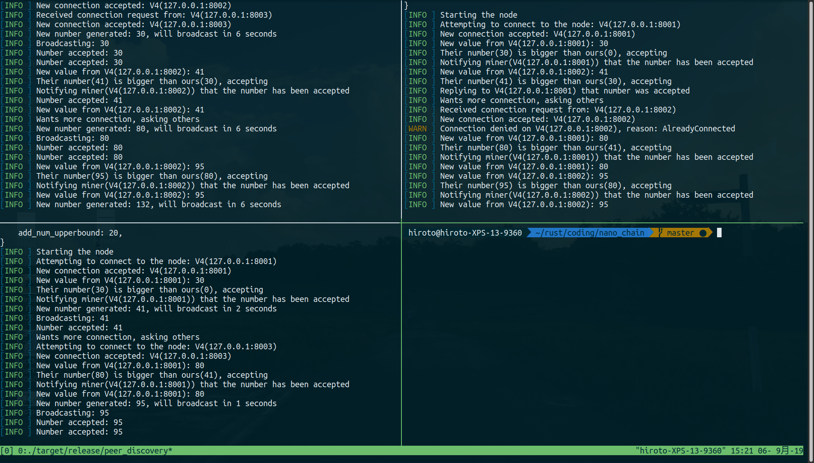

# nano chain

## Overview

This repository contains series of project in which I try to understand:
- What the rustlang is capabale of
- How to write good rust code
- How does rust deal with concurrency, networking, serialization, etc.

## UTXO model

Implmentation of simple UTXO model.
In most cryptocurrencies, transactions map a number of inputs to a number of
outputs, roughly as follows:

```rust
pub struct Transaction {
    id: TransactionId,
    inputs: Vec<Input>,
    outputs: Vec<Output>,
}
```

The `id` is simply a unique identifier for the transaction.
The idea is that all the inputs are completely consumed, and the money contained
therein is redistributed to the outputs.
An `Output` is a value indicating an amount of currency, and an address of a
recipient. We use String to model addresses, and keep values all as integers.

```rust
pub struct Address(String);
pub struct Coin(u64);

pub struct Output {
    value: Coin,
    address: Address,
}
```

An `Input` must actually refer to a previous output, by providing an `Id` of a
transaction and a valid index into the list of outputs of that transaction.

```rust
type Index = usize;
pub struct TransactionId(u32);

pub struct Input {
    index: Index,
    id: TransactionId,
}
```

In processing transactions, we keep track of “unspent transaction outputs”
(**UTXOs**) which is a hashmap indicating which outputs can still be used as inputs:

```rust
pub struct UTXO {
    store: HashMap<Input, Output>,
}
```

The outputs contained in this map are exactly the unspent outputs. In order to
refer to an `Output`, we need its transaction id and its index, therefore the keys
in this map are of type `Input`.

## Basic proof of Work

Blockchain module introduces basic proof of work model. It is direct translation of
[Nanochain](https://github.com/adjoint-io/nanochain/blob/master/src/Nanochain.hs)'s 
Block building code into rust.

## Peer discovery

Basic implementation of peer-to-peer network capable of propagating shared states.



In a p2p setting, every process acts as both a server and a client. Executing
multiple processes will create a network where each proccess will connect to each
other. They will also propagate a bit of shared state, which is a biggest number
within the network.

### How to run

#### Build from this repository

1. Build the project

```terminal
cargo build --release
```

2. Launch tmux

```terminal
tmux
```

3. Run the script

```terminal
./scripts/run-node.sh
```

#### Using docker

You can also use docker container.

1. Pull image from dockerhub

```terminal
docker pull shioihi/rust-nano-chain
```

2. Run the container with interactive mode

```terminal
docker run -it shiohi/rust-nano-chain
```

3. Run tmux

```
tmux
```

4. Run the script

```
./scripts/run-node.sh
```

## Todo

- [ ] Add tests
- [ ] Setup CI
- [ ] Better documentation
- [ ] Improve exception handling
- [ ] Run server which enables you to interact with the node 